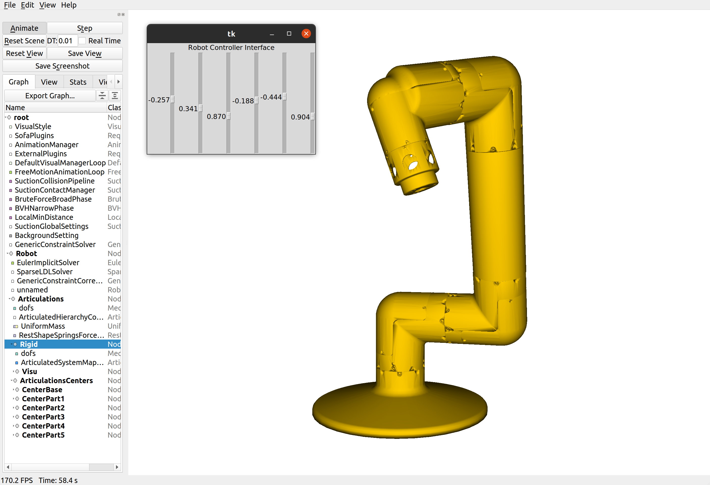

# Articulated Arm 



## Requirements 

- [SofaPython3](https://github.com/sofa-framework/SofaPython3) plugin for SOFA

### Optional

To use a GUI to control the robot you need to install [tkinter](https://docs.python.org/3/library/tkinter.html) for python. For instance on Ubuntu:

`sudo apt-install python-tk`

and uncomment the following lines in `robot.py`:

```python
    from robotGUI import RobotGUI  # Uncomment this if you want to use the GUI
```
```python
    robot.addObject(RobotGUI(robot=robot))  # Uncomment this if you want to use the GUI
```

## How to run the simulation

```bash
runSofa robot.py
```

