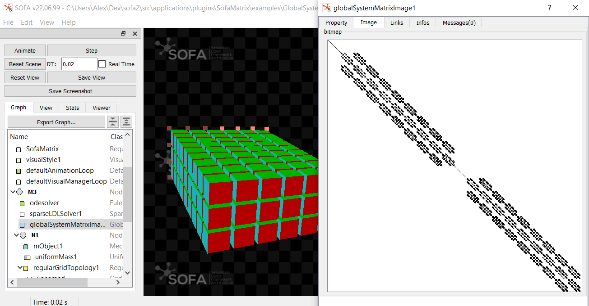

# SofaMatrix

SofaMatrix is a SOFA plugin containing components related to linear system matrices.

## Components

The plugin contains the following components that can be placed into a SOFA scene:

### GlobalSystemMatrixExporter

GlobalSystemMatrixExporter is a component to export the matrix of a linear system as a file.

#### Filename

A Data "filename" is available to specify the name of the exported file.
If "filename" is not set, it gets the name of the component.

"filename" can be an absolute path, or relative to the SOFA executable.
Directories are created if necessary.

The extension in "filename" defines the file format.

A number is added after the filename.
It corresponds to the number of elapsed time steps when the file is exported.

Depending on the Data "exportEveryNumberOfSteps", the matrix can be export only at specified number of time steps.

#### Supported File Format

GlobalSystemMatrixExporter supports the following file formats:
* **txt**: exports a Python-like list of lists, containing all the matrix values including the zeros.
It uses the `operator<<` in `BaseMatrix`.
* **csv**: exports a simple comma-separated values file, containing all the matrix values including the zeros.
* **jpg**: exports a binary image where white pixel means the value is zero, and black
pixel means the value is non-zero.
* **png**: exports a binary image where white pixel means the value is zero, and black
  pixel means the value is non-zero.
* **bmp**: exports a binary image where white pixel means the value is zero, and black
  pixel means the value is non-zero.

#### Link to Linear Solver

GlobalSystemMatrixExporter must have a link to a linear solver (a component inheriting from `sofa::core::behavior::LinearSolver`).

The link can be explicit. Example:
```xml
<GlobalSystemMatrixExporter linearSolver="@pathToLinearSolver"/>
```

The link can be implicit. I.e the component will search for a linear solver in the current Node. Example:
```xml
<SparseLDLSolver/>
<GlobalSystemMatrixExporter/>
```

A use case is available in the examples folder.

### GlobalSystemMatrixImage

GlobalSystemMatrixImage is a component to visualize the matrix of a linear system in a
Qt widget.

#### Link to Linear Solver

GlobalSystemMatrixImage must have a link to a linear solver (a component inheriting from `sofa::core::behavior::LinearSolver`).

The link can be explicit. Example:
```xml
<GlobalSystemMatrixImage linearSolver="@pathToLinearSolver"/>
```

The link can be implicit. I.e the component will search for a linear solver in the current Node. Example:
```xml
<SparseLDLSolver/>
<GlobalSystemMatrixImage/>
```

A use case is available in the examples folder.

#### Screenshot




### FillReducingOrdering

This component reorders the degrees of freedom in a mesh in order to reduce fill-in in sparse matrix factorization.
Two methods of reordering are available:
1) Metis
2) Approximate minimum degree (AMD) from Eigen

The example `FillReducingOrdering.scn` shows how to use this component.
In this simulation, the same object is simulated twice:
1) No reordering method is applied
2) A reordering method is applied

It can be observed that the number of non-zero values in the matrix decomposition is about 80% lower when the vertices are reordered.
It results to a faster matrix system resolution.
