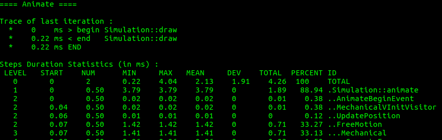

---
title: AdvancedTimer usage and technical documentation
date: 2017-08-24
author:
- Guillaume Grosshenny
...

\newpage

\tableofcontents

\newpage

Dependency
============

You'll need to install *Matplotlib* (<https://matplotlib.org/>) to use the given python scripts for plotting operations. WARNING ! Without this dependency, you'll not be able to use the scripts ! 

If you don't want to install *Matplotlib*, you can still use the *AdvancedTimer* methods in *Python* and plot the *JSON* files without the library. *However* it is strongly recommanded to use *Matplotlib*.

Principle of the AdvancedTimer
==============================

The *AdvancedTimer* is a kind of "supervisor" that can be called in any part of the *SOFA framework*. Then you can use it to measure the time of each componants of the simulation or the initialization of a given scene in the same way. 

For each measure, you'll get the decomposition of time spent by each componants of your *entire scene graph*. That means that the entire tree is covered and you can make graphics of all componants on a *same level* or the decomposition of *all children* of a specified componant.

AdvancedTimer usage
===================

## Available output types

There are three types of output that you can use with *AdvancedTimer*. You can change the outputType at anytime during the measure and the default output type is the *STDOUT*. 

* *STDOUT*: the old output used by the *AdvancedTimer* before its enhancement. You can see an example of this output in figure 1. This output is returned in the standard output.
* *JSON*: this one return a *JSON* object with the representation of the entire componants graph. It can be usefull if you want to create graphics of a componant and all its sub-level componants (cf figure 2). 
* *LJSON*: for *light json* return a *JSON* object, but insteed of representing all the sub-level componants, this one only give the father of each componant. It is less precise but easier and faster to parse it (cf figure 2).




\newpage

## Available methods

You can call the following methods both on *C++* and *Python*, there will be defined as C++/python: 

* **Clear()/timerClear()**: clear the timer with the given ID.
* **isEnabled(str id)/timerIsEnabled(str id)**: tell if the timer is enabled or not.
* **setEnabled(str id, bool val)/timerSetEnabled(str id, bool val)**: Enable or disable the timer with the given ID.
* **setInterval(str id, int interval)/timerSetInterval(str id, int interval)**: set the timer capture interval (ie number of steps between each capture).
* **getInterval(str id), timerGetInterval(str id)**: return the interval of the timer with the current ID.
* **begin(str id)/timerBegin(str id)**: begin the time capture for the given timer with the given ID.
* **steBegin(str id)/timerStepBegin(str id)**: set the flag for begin a sub-time capture for the timer with the given ID. It means that the begin or *timerBegin* will analyze the section between *timerStepBegin* and *timerStepEnd*.
* **stepEnd(str id)/timerStepEnd(str id)**: set the flag gor end a sub-time capture for the timer with the given ID.
* **end(str id, node* n)/timerEnd(str id, node* n)**: return the value of the time analysis with specified output type (see setOutputTypê and timerSetOutputType for more information) of the timer with the given ID.
* **setOutputType(str id, str outputType)/timerSetOutputType(str id, str outputType)**: set the output type with the given value to the timer with the given ID.

## How to use AdvancedTimer in a scene in python

If you want to use the *AdvancedTimer* in a *Python scene*, the easiest way to do it is to use the given scripts with the method measureAnimationTime. You will have to add this line: 

```py
    from SofaPython import PythonAdvancedTimer
```

at the beginning of your script. Then you have to add the method *bwdInitGraph(self, node)* method at least as the following:

```py
    def bwdInitGraph(self, node):
        # Call the animate method to
        PythonAdvancedTimer.measureAnimationTime(node, "timerPoutre", 
        2, "ljson", "poutre_grid_sofa_timerLog", 0.1, 1000)
        return 0
```

If you already have defined a bwdInitGraph, you juste have to add the *measureAnimationTime()* method to get your scene analyzed.

To use it by your own way, you can take a look at the *PythonAdvancedTimer.py* script. You'll find it in the *Sofa project* at *SofaPython/python/SofaPython/PythonAdvancedTimer.py*.

Given scripts for data plotting
===============================

Two plotting scripts are allready implemented in *SOFA* : *TimerLJSONPlot.py* and *timerLjsonManyFilesPlot.py*. The first one create a plot from one *light JSON* file with the given componant(s) and the second one create a plot with the given files (at least two) and the given componant(s). The difference between the two scripts is that the first one was made to create a graph for precise analysis of a simulation and the second one for performance comparisons. 

With the *TimerLJSONPlot.py*, you can choose the deepness of the analysis (if you want a deep analysis, it will create a graph with the componant(s) and its(their) children). The script can be call in command line with the terminal as follow : 

~~~~
python timerLjsonPlot.py [LJSONFileName] -d [deepness] -v [Value] 
  -c [Componant1] [Componant2] ...
~~~~

where *LJSONFileName* is the file to plot, *-d deepness* is used to specify the deepness of the analysis (0 is for an analysis with componants on the same level and 1 with the children of the componant. Default value is 0), *-v [ValueToSearch]* is used to specify the value to search in the *Values* key in LJSON file (the *Values* key store the data of the time measure of the componant. Available values are : Dev, Level, Max, Mean, Min, Num, Percent, Start, Total) and *-c [Componant1] [Componant2] ...* is used to give the componant(s) to analyse (you can give one or more componant(s)).

With the *timerLjsonManyFilesPlot.py*, you can plot multiple *light JSON* files for one componant. It's usefull to make performance comparison between two or more simulations. You can also use it in command line with the terminal as follow : 

~~~~
python timerLjsonManyFilesPlot.py [Componant] -v [Val] -j [LJSONFile1] 
[LJSONFile2] ...
~~~~

where *Componant* is the componant to analyse, *-v [val]* is the same than with *TimerLJSONPlot.py* and *-j [LJSONFile1] [LJSONFile2] ...* is used to give the *light JSON* file names to plot (you have to give one or more file names).

\newpage

Example scene
=============

~~~~{#exampleSceneCode .py }
import Sofa
import os
import sys
from contextlib import contextmanager
from SofaPython import PythonAdvancedTimer


class poutreGridSofa(Sofa.PythonScriptController):

    def createGraph(self, node):

        self.rootNode = node.getRoot()

        # Creation of stuff needed for collision management
        node.createObject('APIVersion', name="17.06")
        node.createObject('RequiredPlugin', name="SofaPython")
        node.createObject('DefaultAnimationLoop')
        node.createObject('CollisionPipeline', depth='6', verbose='0', 
        draw='0')
        node.createObject('BruteForceDetection')
        node.createObject('CollisionResponse', response='default')
        node.createObject('DiscreteIntersection')
        node.createObject('VisualStyle', displayFlags="showBehaviorModels 
        showForceFields showVisual" )

        # Creation of the 'poutreRegGrid' node
        poutreRegGridNode = node.createChild('poutreRegGrid')
        # Add solver
        poutreRegGridNode.createObject('EulerImplicit', name='cg_solver', 
        printLog='false')
        poutreRegGridNode.createObject('CGLinearSolver', iterations='25', 
        name='linearSolver', tolerance='1.0e-9', threshold='1.0e-9')
        # Creation of the regular grid
        poutreRegGridNode.createObject('MechanicalObject', name='mecaObj')
        poutreRegGridNode.createObject('RegularGrid', name='regGrid', nx='3', 
        ny='5', nz='10', min='2.495 -0.005 -0.005', max='2.535 0.065 0.205')
        # Set a topology for boxROI
        poutreRegGridNode.createObject('HexahedronSetTopologyContainer', 
        src='@regGrid', name='Container')
        poutreRegGridNode.createObject('HexahedronSetTopologyModifier', 
        name='Modifier')
        poutreRegGridNode.createObject('HexahedronSetTopologyAlgorithms', 
        template='Vec3d', name='TopoAlgo')
        poutreRegGridNode.createObject('HexahedronSetGeometryAlgorithms', 
        template='Vec3d', name='GeomAlgo')
        # Physic manager
        poutreRegGridNode.createObject('HexahedronFEMForceField', name='HFEM', 
        youngModulus='1000', poissonRatio='0.2')
        # BoxConstraint for fixed constraint (on the left)
        poutreRegGridNode.createObject('BoxROI', name="FixedROI", box="2.495 
        -0.005 -0.005 2.535 0.065 0.0205", position='@mecaObj.rest_position')
        poutreRegGridNode.createObject('FixedConstraint', template='Vec3d', 
        name='default6', indices='@FixedROI.indices')
        # BoxROI for constant constraint (on the right)
        poutreRegGridNode.createObject('BoxROI', template='Vec3d', box='2.495 
        -0.005 0.18 2.535 0.065 0.205', name='box_roi2', position='@mecaObj.rest_position')
        poutreRegGridNode.createObject('ConstantForceField', indices="@box_roi2.indices", 
        force='0 -0.1 0', arrowSizeCoef='0.01')

        # Visual node
        VisualNode = poutreRegGridNode.createChild('Visu')
        VisualNode.createObject('OglModel', name='poutreRegGridVisual', 
        fileMesh='../../mesh/poutre_surface.obj', color='red', dx='2.5')
        VisualNode.createObject('BarycentricMapping', input='@..', 
        output='@poutreRegGridVisual')


    def bwdInitGraph(self, node):
        # Call the animate method to
        PythonAdvancedTimer.measureAnimationTime(node, "timerPoutre", 2, 
        "ljson", "poutre_grid_sofa_timerLog", 0.1, 1000)
        return 0


def createScene(node):
    obj = poutreGridSofa(node)
    obj.createGraph(node.getRoot())
~~~~


